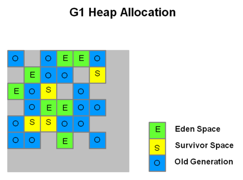
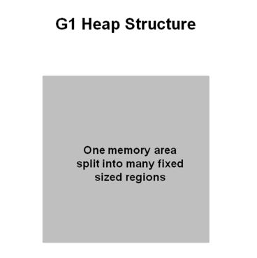
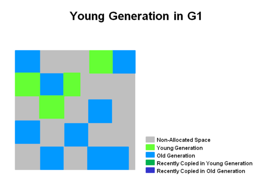
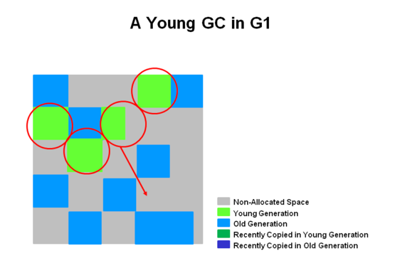
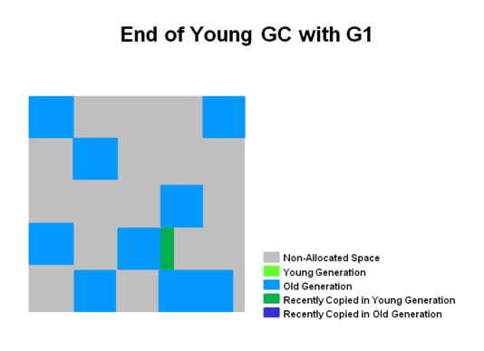
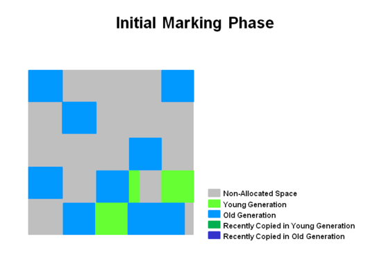
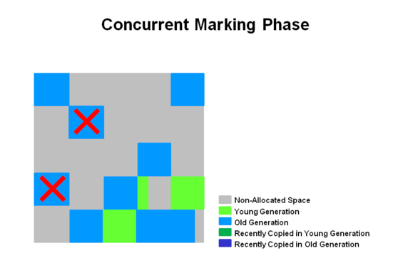
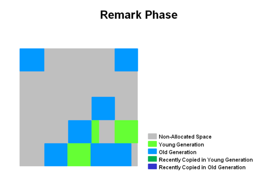
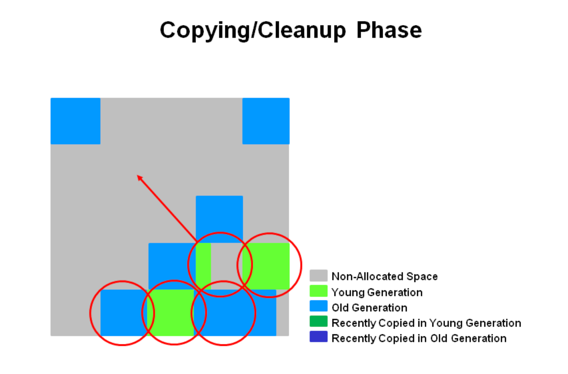
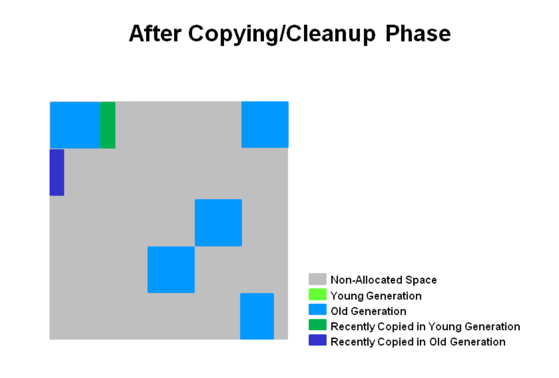

### 지원

# G1 GC
G1 GC는 대용량 메모리를 사용하는 multi-processor 시스템을 대상으로 하는 server-style GC이다.
높은 처리량을 달성하면서도 GC Pause time 목표를 높은 확률로 충족한다.

# 1. 특징 
- CMS GC처럼 애플리케이션 스레드와 동시에 작동한다.
- 긴 GC로 인한 Pause time 없이 빈 공간을 압축한다.
- 예측 가능한 GC Pause time이 필요할 때 좋다.
- Throughput 성능을 크게 희생하고 싶지 않을 때 좋다.
- 더 큰 Heap이 필요하지 않다. 

# 2. 왜 나왔을까?

G1은 CMS의 장기적인 대체제로 계획되었다. G1은 CMS에 비해 아래 차이점이 있다. 
1. Compaction이 있다.
   - 메모리 할당을 위해 세분화된 free list를 사용할 필요가 없을 만큼 충분히 메모리를 압축하며, 대신 'Region' 기반 구조에 의존한다.
   - 이 방식은 collector의 일부 part를 상당히 단순화하고, 잠재적인 Fragmentation 문제를 대부분 제거한다.
2. 더 predictable한 GC Pause를 제공한다.
   - 사용자가 원하는 일시정지 목표(pause target)를 직접 지정할 수 있다. 

# 3. 작동 방식

## Heap Allocation

- 힙은 동일한 크기의 여러 Region으로 나뉘며, 각 Region은 연속된 가상 메모리 구간으로 구성된다.
- 일부 Region 집합은 이전 수집기들처럼 Eden, Survivor, Old 영역과 같은 역할을 맡지만, 그 크기가 고정되어 있지는 않다.
- 이러한 구조 덕분에 메모리를 훨씬 더 유연하게 사용할 수 있다.

## Heap Structure

- 힙은 하나의 메모리 영역이지만, 내부적으로 고정된 크기의 여러 Region으로 나뉜다.
- 이 Region의 크기는 JVM이 시작될 때 자동으로 결정되며, 일반적으로 약 2000개의 Region을 목표로 하며, 각 Region은 1MG ~ 32MB 크기를 가진다.
- 이러한 Region들은 논리적으로 Eden, Survivor, Old Generation 공간에 매핑된다.
- Live Object는 한 Region에서 다른 Region으로 Evacuation(복사 또는 이동) 된다.
- 이 구조 덕분에 G1은 모든 애플리케이션 스레드를 멈추지 않고도(또는 멈추더라도) 병렬로 Region 단위 수집이 가능하다.

## Region의 종류
- Eden Region : 새로 생성된 객체들이 처음 저장되는 영역
- Survivor Region : Young GC에서 살아남은 객체가 이동하는 영역
- Old Region : 여러 번의 Young GC를 통과해 장기 생존한 객체들이 저장되는 영역
- Humongous Region : 일반 Region 크기의 50% 이상인 큰 객체를 저장하기 위한 영역
  - 이러한 객체는 연속된 여러 Region에 저장된다.
- Unused Region : 아직 사용되지 않은 힙 영역

>  현재 시점(2025.10.30) 기준으로 Humongous Object의 수집은 아직 최적화되어 있지 않습니다.
> 따라서 이런 크기의 객체 생성은 가능하면 피하는 것이 좋다.

## Young Generation

힙은 약 2000개의 Region으로 나뉘며, 각 Region의 최소 크기는 1MB, 최대 크기는 32MB이다.
 파란색 Region은 Old Generation 객체, 초록색 Region은 Young Generation 객체를 저장한다.

이전 GC와 달리, Region들은 반드시 연속적(contiguous)일 필요가 없다.
 즉, Young 영역과 Old 영역이 메모리 상에 흩어져 존재할 수 있다.

## A Young GC

Young GC가 발생하면, Live Object 들은 하나 이상의 Survivor Region으로 Evacuation(복사 또는 이동) 된다.
 만약 객체의 age가 임계값(aging threshold)에 도달하면, 일부 객체는 Old Generation Region으로 Promotion된다.

이 과정은 STW 이벤트로, 모든 애플리케이션 스레드가 잠시 중단된다.
 다음 Young GC를 위해 Eden과 Survivor의 크기가 새로 계산된다.
 이때 pause time goal 와 같은 요소들도 함께 고려된다.

이러한 방식 덕분에 Region의 크기를 필요에 따라 쉽게 확장하거나 축소할 수 있다.

## End Of a Young GC

Young GC 이후, Live Object들은 Survivor Region 또는 Old Generation으로 evacuation된다.
 새로 promotion된 객체들은 짙은 파란색, Survivor 영역은 초록색으로 표시된다.

정리하자면, G1의 Young Generation은 다음과 같은 특징을 가진다:
- 힙은 하나의 메모리 공간이지만, 여러 Region으로 분할되어 있다.
- Young Generation은 연속되지 않은(non-contiguous) 여러 region으로 구성되어 있으며, 필요에 따라 크기를 쉽게 조정할 수 있다.
- Young GC는 STW 이벤트로, 수행 중에는 모든 애플리케이션 스레드가 중단된다.
- Young GC는 여러 개의 스레드가 병렬로 수행된다.
- Live object들은 새로운 Survivor Region이나 Old Generation Region으로 copy된다.

## Old Generation Collection 
CMS와 마찬가지로, G1 collector는 Old Generation 객체를 대상으로 한 Low pause collector로 설계되었다.

## G1 Collection Phases - Concurrent Marking Cycle Phases
G1 collector는 힙의 Old Generation 영역에 대해 다음과 같은 단계를 수행한다.
 일부 단계는 Young Generation 수집 과정의 일부로 함께 수행되기도 한다.

| Phase                            | Description                                                                                                                                                                                                            |
|----------------------------------|------------------------------------------------------------------------------------------------------------------------------------------------------------------------------------------------------------------------|
| Initial Mark(STW)                | 이 단계는 일반적인 Young GC와 함께 수행된다. Old Generation의 객체를 참조할 수 있는 Survivor Region(Root Region) 들을 Marking한다.                                                                                                              |
| Root Region Scanning(Concurrent) | Survivor Region을 스캔하여 Old Generation 객체를 참조하는 포인터를 찾는다. 이 과정은 애플리케이션 스레드와 동시에 수행된다. 단, 이 단계는 다음 Young GC가 발생하기 전 반드시 완료되어야 한다.                                                                                 |
| Concurrent Marking               | 힙 전체를 대상으로 Live object를 찾는다. 이 단계 역시 애플리케이션 스레드와 동시에 수행된다. 단, Young Generation의 GC가 발생하면 일시적으로 중단될 수 있다.                                                                                                       |
| Remark(STW)                      | 힙 내 Live Object의 Marking을 최종적으로 완료하는 단계다. SATB(Snapshot-At-The-Beginning) 알고리즘을 사용하며, 이는 CMS collector에서 사용되던 방식보다 훨씬 빠르다.                                                                                         |
| Cleanup(STW + Concurrent)        | - (STW) Live Object와 완전히 비어있는 Region에 대한 회계 정보(accounting)를 정리한다. - (STW) Remebered Set을 정리(scrub)한다. - (Concurrent) 비어있는 Region을 초기화(Reset)하고 Free List로 반환한다.                                                |
| (*) Copying(STW)                 | Live Object를 새로운 Unused region으로 Evacuation(복사 또는 이동)하는 단계이다. 이 단계는 STW로 수행된다. - Young Region만 포함된 경우 : 로그에 `[GC pause (young)]` 로 표시된다. - Young과 Old Region이 모두 포함된 경우 : 로그에 `[GC Pause (mixed)]` 로 표시된다. |

### 1. Initial Marking Phase

살아있는 객체(Live Object)의 초기 마킹은 Young Generation의 garbage collection과 함께 수행(piggyback)된다.
 로그에서는 다음과 같이 표시된다:
> GC pause (young)(initial-mark)

### 2. Concurrent Marking Phase

Empty Region("X"로 표시된)이 발견되면, 그것들은 Remark Phase에서 즉시 제거된다.
 또한, 객체의 생존 여부(liveness)를 결정하는 "accounting" 정보가 계산된다.

### 3. Remark Phase

Empty Region들이 제거되고 회수된다.
 이제 모든 영역에 대해 생존율(liveness)이 계산된다.

### 4. Copying/Cleanup Phase

G1은 Liveness가 가장 낮은, 즉 가장 빠르게 수집할 수 있는 영역들을 선택한다.
 그런 다음 이 영역들은 Young GC와 동시에 수집된다.
로그에서는 다음과 같이 표시된다:
> GC pause (mixed)

즉, Young Generation과 Old Generation이 동시에 수집된다.

### 5. After Copying/Cleanup Phase

선택된 영역들은 수집되어 compaction되며, 그림에서 짙은 파란색 영역과 짙은 초록색 영역으로 표시된다.

### Summary Of Old Generation GC

요약하면, G1의 Old Generation Garbage Collection에 대해 다음과 같은 key point가 있다.
- Concurrent Marking Phase
  - Liveness 정보는 애플리케이션이 실행되는 동안 동시에 계산된다.
  - 이 Liveness 정보는 Evacuation Pause 중 어떤 영역을 회수하는 것이 가장 적절한지 식별한다.
  - CMS와 같은 Sweeping 단계는 존재하지 않는다.
- Remark Phase
  - CMS에서 사용한 방식보다 훨씬 빠른 SATB 알고리즘을 사용한다.
  - 완전히 비어있는 Region은 회수된다.
- Copying/Cleanup Phase
  - Young Generation과 Old Generation이 동시에 회수(reclaim)된다.
  - Old Generation 영역들은 그것들의 Liveness에 따라 선택된다.

### [참고링크](https://www.oracle.com/technetwork/tutorials/tutorials-1876574.html)
