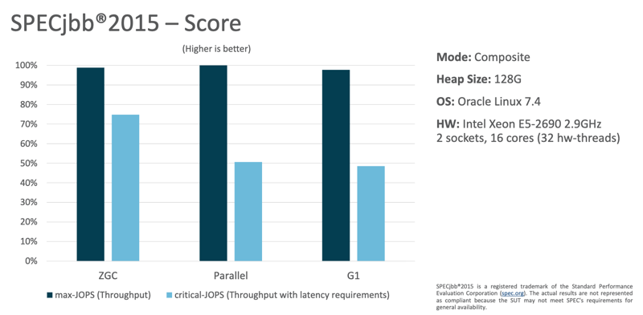
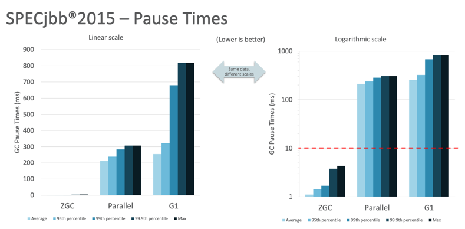
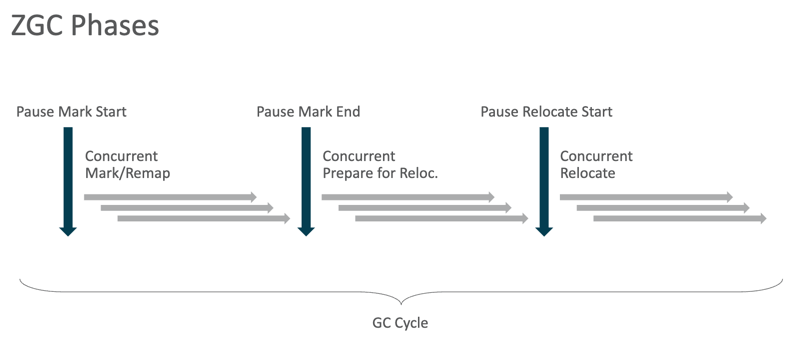
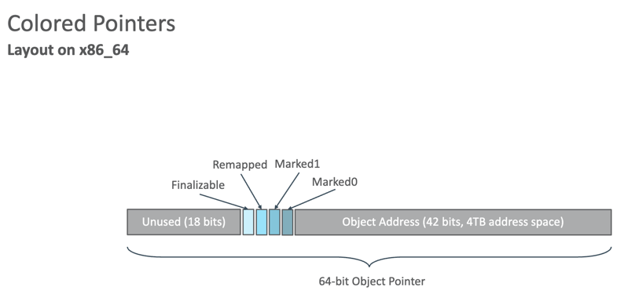

# ZGC
ZGC는 Z Garbage Collector로, scalable한 low latency garbage collector이다.

## 개요
ZGC는 JDK 11에서 experimental feature로 처음 도입되었으며,
<br>JDK 15에서 production ready 단계로 선언되었다.
<br>그리고 JDK 21에서는 generation을 지원하도록 reimplemented(재구현)되었다.

## 한눈에 보는 특징
- Concurrent
  - GC의 거의 모든 작업을 애플리케이션 스레드와 동시에 처리한다.
  - STW 구간은 수백 μs 수준으로 매우 짧다.
- Region-based
  - 힙을 동일 크기의 Region 단위로 나누어 관리한다.
  - 각 Region은 개별적으로 Mark, Relocate, Free 가능하다.
- Compacting
  - 객체를 새로운 Region으로 옮겨(복사) 단편화를 해소한다.
  - ZGC는 Compaction조차 Concurrent하게 처리한다.
- NUMA-aware
  - CPU가 여러 메모리 노드를 가진 시스템(NUMAness)에서 메모리 접근 비용 차이를 고려해 객체를 적절한 메모리 노드에 배치
- Using colored pointers
  - 64비트 포인터의 상위 비트를 색깔(color) 비트로 사용해
  - Mark 여부, Remapped 여부, Forwarding 여부를 나타낸다.
  - 즉, 객체 Header를 건드리지 않고 GC 정보를 표현 가능하다.
- Using load barriers
  - 객체를 읽을 때(load) 실행되는 소프트웨어 barrier
  - 객체가 이동되었는지 확인하고, 필요하면 pointer를 새 주소로 수정(remap)한다.
  - 즉, 애플리케이션이 실행되는 동안에도 안전하게 Relocation이 가능하다. 
- Using store barriers
  - JDK 21부터 도입된 Generational ZGC에서만 사용한다. 
  - 객체 참조를 저장(store)할 때 실행되는 barrier
  - Young/Old 간 참조 변화를 추적하기 위해 사용한다.

ZGC의 핵심은 concurrent garbage collector라는 점이다.
<br>즉, 모든 무거운 작업이 Java 스레드가 계속 실행되는 동안 수행된다는 뜻이다.
<br>이로 인해 garbage collection이 애플리케이션의 response time에 미치는 영향을 크게 제한한다.

## 특징
ZGC는 모든 비용이 큰 작업을 Concurrent로 수행하며, 애플리케이션 스레드의 pause time을 1ms 이하로 유지한다.
<br>따라서 low latency가 요구되는 애플리케이션에 적합하다.
<br>ZGC의 pause time은 사용중인 힙 크기와 무관하며, 수백 MB(최소 8MB)에서 최대 16TB의 힙 크기까지 안정적으로 동작한다.

ZGC는 자동으로 적응(adaptive) 하도록 설계되었으며, 수동 설정이 거의 필요하지 않도록 만들어졌다.
<br>Java 프로그램이 실행되는 동안, ZGC는 workload에 따라 동적으로 적응(dynamically adapts)하며 다음을 수행한다.
- Resizing Generation
- GC 스레드 수 확장
- 객체 승격(tenuring) 임계값 조정 (adjusting tenuring thresholds)

## 장점
1. latency 요구사항이 있는 throughput에서도 처리량이 높다.
   
2. Pause time이 짧다.
    

## 동작 과정

### Minor GC
1. Pause Young Mark Start
   - Young roots가 가리키는 객체들을 Marking
   - 이 pause는 매우 짧다.
2. Concurrent Young Mark
   - Young 객체의 그래프를 순회하며 살아있는 객체들을 Marking
   - Young generation의 각 region을 분석하여 live ratio가 낮은 region을 골라 relocation set으로 정한다.
   - store barrier가 Old -> Young 참조를 tracking하여 marking 지원 (load barrier 부하 최소화)
3. Pause Mark End 
   - Synchronization point: Young marking 결과 finalize 및 정리
   - 짧은 pause
4. Pause Young Relocate Start 
   - Young roots가 relocation set을 가리키는 참조를 처리하면서 root forwarding 테이블을 업데이트해 old 주소를 읽어도 바로 new 주소로 remap한다.
   - 매우 짧은 pause
5. Concurrent Relocate
   - relocation set의 객체들을 relocate
   - 선택된 region의 객체를 새로운 region으로 이동 (compaction)
   - load barrier가 old-to-new pointer 업데이트

### Major GC
1. Pause Mark Start
   - 전체 roots (young + old)가 가리키는 객체들을 marking
2. Concurrent Mark
   - Young + Old 전체 객체 그래프를 순회하며 살아있는 객체들을 marking
   - low live ratio regions은 relocation set으로 선택한다.
   - store barrier + load barrier를 사용한다.
3. Pause Mark End
   - Synchronization point: 전체 marking finalize 및 weak roots cleaning
   - 짧은 pause.
4. Pause Relocate Start
   - 전체 roots가 relocation set을 가리키는 참조 처리 및 root forwarding 테이블을 업데이트한다.
   - 매우 짧은 pause.
5. Concurrent Relocate 
   - low live ratio regions의 객체들을 새 region으로 relocate 한다.
   - load barrier가 old-to-new pointer를 업데이트한다.



## Colored Pointers
- ZGC의 핵심 설계 개념
- Metadata가 64비트 포인터의 사용되지 않는 비트들에 저장된다.
  - 32bit 플랫폼에서는 지원되지 않음
  - CompressedOops도 지원되지 않음
- Virtual Address-masking은 주로 OS/소프트웨어 수준에서 수행된다.
  - Linux/x86_64에서는 Heap multi-mapping 방식으로 사용



### 무슨 말이냐?
ZGC는 64비트 참조 포인터의 상위 비트 일부를 color 비트로 사용한다.
<br>JVM이 객체 참조를 단순한 "메모리 주소"로만 쓰지 않고, GC 메타데이터(tag)를 담아둔다.
<br>즉, 객체 포인터 = [메모리 주소 + GC 상태 비트] 이고, 이 GC 상태 비트가 바로 color이다.

Color Bits 용도
1. Marked0, Marked1 : Marking 색상 정보
   - 이번 GC 사이클에서 방문(mark)했는지 여부
2. Remapped : Remapping 판단 정보
   - Load barrier가 객체를 load할 때, 그 참조가 "이미 새 주소로 이동된 객체인지?", "아직 relocation set 안에 있는 오래된 주소인지?" 판단하는 데 사용한다.
3. Finalizable : Finalizable를 통해서만 reachable한 상태인지
   - (Generational ZGC에서 store barrier 사용 시)

### ❓ 왜 Marked bit가 0/1 두 개일까?
ZGC는 Concurrent Marking을 하기 때문에, 
<br>"이번 cycle에서 방문한(marked) 객체인지", "이전 cycle에서 방문한(marked) 객체인지" 를 구분해야 한다.
Marked0/Marked1은 그냥 두가지 색의 이름이다.

예를 들어,

GC cycle 1

- 이번 사이클의 mark 색 = Marked 0
- 이전 사이클의 mark 색 = Marked 1

GC cycle 2

- 이번 사이클의 mark 색 = Marked 1
- 이전 사이클의 mark 색 = Marked 0

-> GC cycle이 실행될 때마다 "이번 cycle에서 사용할 색"을 Marked0 <-> Marked1로 flip한다.
 
- 이번 cycle에서 MarkedX의 bit가 1이 아니면 dead 객체로 판단 가능
- 별도의 보조 bitmap을 사용할 필요 없음
- mark bitmap을 clear/reset 할 필요 없음
- 즉, reset 비용 없이 계속 marking cycle을 이어가기 위한 장치다.

만약 mark bit가 1개뿐이라면?

- GC cycle이 시작될 때, 전체 힙의 mark bit를 전부 0으로 리셋해야 한다.
- 이 작업은 힙이 작으면 괜찮지만, TB급에서는 수백 ms ~ 수 s 걸릴 수 있다.
- ZGC는 ultra-low pause time이 목표이므로 대량 reset 작업 자체를 없애야 한다.

그래서:
- 이전 cycle bit = 예전 mark 결과
- 이번 cycle bit = 새로운 mark 결과

이렇게 bit를 flip하면서 reset 없이 marking을 할 수 있게 된다.

### ❓Finalizable bit는 뭘까?
객체가 finalizer를 통해서만 reachable(finalizable reachably-only)한 객체인지 표시하는 것이다.
finalizer reachable이란 finalize()가 실행될 때까지 GC가 객체를 즉시 회수하지 않고 finalization queue에 넣기 위해 잠시 reachable로 취급하는 특별한 상태다.

finalizer의 핵심원칙 
- GC가 객체를 회수하기 직전 strong reference가 없으면 바로 회수할 수 있다.
- 그러나 객체가 finalize()를 override 했다면 회수하기 전에 finalize()를 실행해야 한다.
- 따라서 GC는 해당 객체를 finalizer queue에 넣기 위해 잠시 살아있는(reachable) 것으로 취급한다.

finalizable bit의 전체 동작 방식
1. GC가 객체의 reachability를 판단한다.
2. 만약 객체가 strong reference로는 도달 불가 & finalize()를 override한 경우, GC는 colored pointer의 finalizable bit를 1로 표시한다.
3. GC는 객체를 finalizer queue에 넣는다.
   - 즉, "finalizable bit = 1" 이면 finalizer queue에 들어갈 대상이라는 의미이다.
   - finalizer queue는 finalizer thread가 처리하는 JVM 전용 큐다.
4. finalizer thread가 obj.finalize()를 실행한다.
   - 이 시점에서 객체가 부활(resurrection)될 수 있다. (finalizer에서 다시 static 변수 등에 넣어버릴 수 있으므로)
   - 이 부활 여부는 finalizable bit와는 무관하다.
5. finalize() 실행이 끝난 후 다시 GC 대상으로 올라간다.
   - 다음 GC cycle에서 finalizer reachable 여부를 다시 평가한다.

finalizer는 Java 21에서 완전 제거(JEP 422)되었기 때문에 
<br>Finalizable bit는 실제 finalization 동작에는 더 이상 사용되지 않으며, historical.diagnostic 용도로만 존재한다.

## Load barrier
객체 pointer(참조)를 load할 때, 그 pointer가 최신 주소인지 확인하고, 필요하면 즉시 remap(올바른 새 주소로 수정)하는 소프트웨어 hook이다.

즉, 애플리케이션 코드가 객체 pointer를 읽는 순간, ZGC는 아래 두 가지를 자동으로 한다.
1. 그 객체가 relocation(이동)된 상태인지 확인한다.
2. 만약 old 주소를 들고 있다면, 즉시 new 주소로 remap(교체)한다.

### 그럼 load barrier가 왜 필요할까?
ZGC는 Compaction도 Concurrent하게 수행한다.
<br>즉, 객체를 이동시키는 동안에도 애플리케이션 스레드(mutator)는 계속 실행된다.
<br>이 때 mutator가 old pointer를 읽으면, 해당 주소는 이미 이동된 객체의 old 주소일 수 있다.
<br>그래서 load barrier가 이를 감지해, old pointer라면 new 주소로 remap하여 반환한다.

load barrier의 역할
1. 참조가 이미 remapped 되었는지 확인한다.
   - colored pointer의 remapped bit를 확인해 old/new를 구분한다.
2. old -> new 주소를 계산한다. 
   - heap을 multi-mapped해 두었기 때문에 간단한 연산으로 new 주소를 얻는다.
3. pointer 업데이트
   - load한 참조가 old pointer라면 remap하여 new pointer로 교체한 뒤 반환한다.
-> 결과적으로 애플리케이션은 항상 new 주소만 사용하게 된다.

## Store barrier
- JDK 21부터 Generational ZGC 도입과 함께 Generational 모드 전용으로 store barrier가 추가되었다.
- Young / Old 세대로 힙을 분리하고, Old -> Young 간 참조를 추적하기 위해 store barrier를 사용한다.
  - Young -> Old는 Young GC시 전체 스캔으로 커버하기 때문에 별도 추적이 필요없다.

### Non-generational ZGC에서는 필요 없었던 이유
- Non-generational ZGC는 세대 구분이 없어 모든 객체가 같은 세대였기 때문에 store barrier가 필요없었다.

### Generational ZGC에서의 store barrier의 역할
1. Old -> Young 참조 발생 시 Remembered Set에 기록한다.
   - Young GC시에 Young 객체만 대상으로 collection을 수행하는 경우, Old 객체의 필드가 Young 객체를 참조하고 있다면 그 참조를 반드시 검사해야 한다.
   - Store barrier는 그런 참조가 생기거나 변경될 때, 해당 필드 주소를 Remembered Set에 기록한다.
2. Young-generation collection 시에는 Remembered Set만 검사 - Old 세대 전체 scan 불필요
   - Minor GC시 Old 세대 전체를 스캔할 필요 없이, Remembered Set에 기록된 필드만 root로 처리하면 된다.
   - 이를 통해 Minor GC의 효율성을 유지한다.
3. 참조 변경 시 해당 객체를 marking하여 살아 있는 것으로 표시
   - Generational ZGC에서는 store barrier가 참조 변경 시 marking을 지원하며, load barrier 부하를 줄인다.

## 튜닝

주요 튜닝 요소는 최대 힙 크기를 늘리는 것이다.

JDK 24부터 Non-generational 모드가 제거되었으므로, 현재 ZGC는 Generational만 지원한다.
<br>즉, `-XX:+UseZGC`로 Generational 모드가 default로 활성화된다.

## Setting the Heap Size
ZGC에서 가장 중요한 튜닝 옵션은 최대 힙 크기를 설정하는 것이다.
이 값은 cli 옵션 `-Xmx` 로 지정할 수 있다.

ZGC는 Concurrent garbage collector이므로, 힙이 애플리케이션의 live-set(현재 살아있는 객체 집합)을 수용할 수 있어야 하며,
<br>동시에 GC가 실행되는 동안에도 새로운 객체 할당을 처리할 수 있을 만큼의 headroom(여유 공간)이 있어야 한다.

필요한 headroom의 크기는 애플리케이션의 allocation rate(객체 할당 속도)와 live-set의 크기에 크게 의존한다.
<br>일반적으로, ZGC에 메모리를 더 많이 할당할수록 성능은 더 좋아진다.
<br>하지만 동시에 불필요한 메모리 낭비는 바람직하지 않으므로, 메모리 사용량과 GC 실행 빈도 간의 균형을 찾는 것이 중요하다.

ZGC에는 힙 크기와 관련된 또 다른 cli 옵션인 `-XX:SoftMaxHeapSize`가 있다.
<br>이 옵션은 Java 힙이 얼마나 크게 성장할 수 있는지를 제한하는 "soft limit(소프트 한계)"를 설정하는데 사용된다.

ZGC는 이 soft limit을 넘지 않으려 노력하지만, allocation stalling을 방지하기 위해 필요시 최대 힙 크기(`-Xmx`) 까지는 한시적으로 초과하여 사용할 수 있다.

예를 들어, cli 옵션이 다음과 같을 경우:
```text
-Xmx5g -XX:SoftMaxHeapSize=4g글
```
ZGC는 자신의 휴리스틱(heuristics)을 적용할 때 4GB를 한계로 사용하지만, 
<br>힙 크기를 4GB 이하로 유지할 수 없는 경우에는 일시적으로 최대 5GB까지 사용할 수 있다.

## Returning Unused Memory to the Operating System

기본적으로 ZGC는 사용되지 않는 메모리를 uncommit(해제)하여 운영체제에 반환한다.
<br>이 기능은 memory footprint(메모리 사용량) 이 중요한 애플리케이션이나 환경에서 유용하지만,
<br>Java 스레드의 latency에 부정적인 영향을 줄 수 있다.

이 기능은 cli 옵션 `-XX:-ZUncommit`으로 disable(비활성화)할 수 있다.

또한, 힙 크기가 최소 힙 크기(-Xms)보다 작아지지 않도록 메모리를 uncommit하지 않는다.
<br>즉, 최소 힙 크기(-Xms)가 최대 힙 크기(-Xmx)와 동일하게 설정된 경우,
<br>이 기능은 암묵적으로 disable된다.

cli 옵션 `-XX:ZUncommitDelay=<seconds>` 를 사용하여 uncommit delay(메모리 해제 지연 시간)를 설정할 수 있다.
<br>기본값은 300초(5분)이다.
<br>이 delay는 메모리가 사용되지 않은 상태로 얼마나 오래 있었을 때 해제되어 운영체제로 반환될 수 있는지를 지정한다.

## 참고
- [Oracle JDK 25 ZGC Tuning Guide](https://docs.oracle.com/en/java/javase/25/gctuning/z-garbage-collector.html)
- [Open JDK wiki](https://wiki.openjdk.org/display/zgc/Main)
- [FOSDEM 2018](https://cr.openjdk.org/~pliden/slides/ZGC-FOSDEM-2018.pdf)
- [ZGC Oracle dev live](https://cr.openjdk.org/~pliden/slides/ZGC-OracleDevLive-2020.pdf)
- [finalize removed](https://docs.oracle.com/en/java/javase/21/docs/api/java.base/java/lang/Object.html#finalize())
- [ZGC deepdive](https://dev.java/learn/jvm/tool/garbage-collection/zgc-deepdive/#load-barriers) 
- [Generational ZGC](https://openjdk.org/jeps/439)
- [Remove the Non-Generational Mode](https://openjdk.org/jeps/490)
