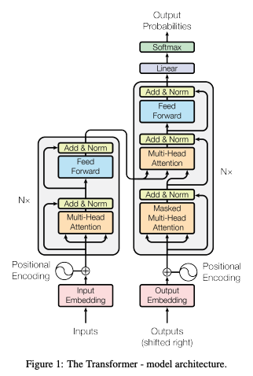
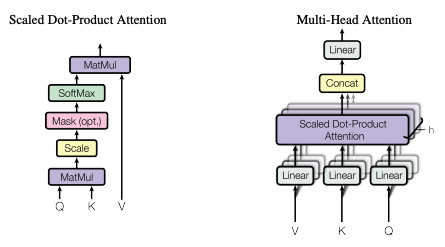

# Attention Is All You Need - 2

> 원문: https://arxiv.org/pdf/1706.03762

## 1. Attention Layer

### Scaled Dot-Product Attention

**공식:**
$$\text{Attention}(K, Q, V) = \text{softmax}\left(\frac{QK^T}{\sqrt{d_k}}\right) \cdot V$$

**Q, K, V 계산:**
- Query: $Q = \text{input} \cdot W_Q$
- Key: $K = \text{input} \cdot W_K$
- Value: $V = \text{input} \cdot W_V$

### 동작 원리
Q(토큰)를 K(토큰)와의 **유사도**를 구해서, V에 대한 **가중합(Weighted Sum)**을 취함으로써 **문맥을 파악**하고 **전체의 의미**를 합친다.

### 예시
1. 유사도 계산: $[\text{토큰} \cdot K_1, \text{토큰} \cdot K_2, \text{토큰} \cdot K_3]$
2. Softmax 적용: $[0.65, 0.25, 0.10]$
   - 이 경우 V는 토큰 전체가 65%, 나머지는 25%, 10%로 섞여서 문장의 의미가 됨
3. 최종 출력: $\text{output}(\theta_n) = a_1V_1 + a_2V_2 + a_3V_3$

### Multi-Head Attention

- Scaled Dot-Product Attention 을 병렬로 처리한 것
- 입력을 **여러 관점으로 바라보기 위해** 사용하며, 여러 개의 attention head를 사용하여 다양한 관계를 학습한다.

---

## 2. Feed Forward Layer

### Attention vs Feed-Forward 비유
| 구분 | 비유 | 역할 |
|------|------|------|
| **Attention** | 정보 수집 | 주변 언어들을 참고해 의미를 모으는 과정 |
| **Feed-Forward** | 생각/추론 | 그 정보를 기반으로 더 깊은 의미를 추론하는 과정 |

- Feed-Forward 예시
  - 주어-술어 관계 파악
  - 일부 특징 강조/억제
  - 문장의 고차원적 패턴 추출

### 특징
- 각 토큰의 위치에서 **개별적으로 수행**됨 (토큰별 독립적인 변환)
- 모델의 **표현력을 높임**
- Attention을 통해 얻은 정보를 **비선형적 형태로 변환**하여 복잡한 관계를 표현 가능

### 공식 (Position-wise)
ReLU 사용 시:
$$\text{FFN}(x) = \max(0, xW_1 + b_1)W_2 + b_2$$

---

> 📌 **ReLU (Rectified Linear Unit)**
> 
> **정의:** $\text{ReLU}(x) = \max(0, x)$ — 음수는 0으로 처리
> 
> **사용하는 이유:**
> 1. **연속적인 비선형성 제공** - 모델이 복잡한 패턴을 학습할 수 있게 함
> 2. **Gradient Vanishing 방지** - Sigmoid, Tanh 대비 강한 기울기 유지
> 3. **희소성(Sparsity) 도입** - 음수 구간을 0으로 처리하여 양수만 살려냄
> 4. **효율성과 간단성** - 구현이 쉽고 계산이 빠름