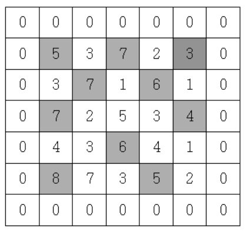

# 문제

지도 정보가 N*N 격자판에 주어집니다. 각 격자에는 그 지역의 높이가 쓰여있습니다.

각 격자판의 숫자 중 자신의 상하좌우 숫자보다 큰 숫자는 봉우리 지역입니다. 봉우리 지역이 몇 개 있는 지 알아내는 프로그램을 작성하세요.

격자의 가장자리는 0으로 초기화 되었다고 가정한다.

만약 N=5 이고, 격자판의 숫자가 다음과 같다면 봉우리의 개수는 10개입니다.

# 입력

첫 줄에 자연수 N이 주어진다.(2<=N<=50)

두 번째 줄부터 N줄에 걸쳐 각 줄에 N개의 자연수가 주어진다. 각 자연수는 100을 넘지 않는다.

# 출력

봉우리의 개수를 출력하세요.

## 예시 입력 

5  
5 3 7 2 3  
3 7 1 6 1  
7 2 5 3 4  
4 3 6 4 1  
8 7 3 5 2  

## 예시 출력
10

## 후기
처음에 이중 loop 내부에서 상, 하, 좌, 우 비교를 위해 또 한번의 loop와 if 조건등을 통해 비교를 하는 방식으로 문제를 풀어냈으나 코드가 너무 복잡해져서 보기가 좋지 않았음.

답안을 보니 해당 문제는 특별한 알고리즘을 통한 풀이라고 할만한 건 없었고 좀 더 가독성 좋고
효율적으로 풀 수 있는 방법이 있었음.

바로 미리 비교가 필요한 x, y 좌표값을 필드에 array로 초기화 해두는 방법.

이렇게 되면 내부에 상, 하, 좌, 우 비교를 위한 조건식들이 간단해지고 코드도 좀 더 간결해지게 된다.

  
📌 정답

  
    public int solution (int n, int[] arr){
            int answer = 0;
            int sum = 0;
            int lt = 0;

            for(int rt = 0; rt < n/2+1; rt++){
                sum += arr[rt];

                if(sum == n){
                    answer++;
                }

                while(sum >= n){
                    sum -= arr[lt++];
                    if(sum == n){
                        answer++;
                    }
                }

            }

            return answer;
        }

## 코드 동작 원리 (예시: 1 2 1 3 1 1 1 2, M=6)
- rt가 이동하며 더하다가 1, 2, 1, 3이 되면 합이 7이 됨. (M보다 큼)
- while문 동작: lt가 가리키는 맨 앞의 1 빼기. 합은 6이 됨.
- 합이 6이므로 count를 증가. ({2, 1, 3} 발견)
- 다음 rt가 이동하여 1을 더하면 합은 7이 됨.
- 다시 lt를 이동시켜 2를 빼기. 합은 5가 됨. (M보다 작으므로 멈춤)
- 이 과정을 끝까지 반복.

