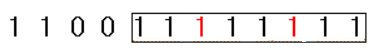

# 문제

0과 1로 구성된 길이가 N인 수열이 주어집니다. 여러분은 이 수열에서 최대 k번을 0을 1로 변경할 수 있습니다. 여러분이 최대 k번의 변경을 통해 이 수열에서 1로만 구성된 최대 길이의 연속부분수열을 찾는 프로그램을 작성하세요.

만약 길이가 길이가 14인 다음과 같은 수열이 주어지고 k=2라면

1 1 0 0 1 1 0 1 1 0 1 1 0 1

여러분이 만들 수 있는 1이 연속된 연속부분수열은



이며 그 길이는 8입니다.

## 입력 </br>
첫 번째 줄에 수열의 길이인 자연수 N(5<=N<100,000)이 주어집니다.

두 번째 줄에 N길이의 0과 1로 구성된 수열이 주어집니다.


## 출력 </br>
첫 줄에 최대 길이를 출력하세요.


## 예시 입력 </br>
14 2 </br>
1 1 0 0 1 1 0 1 1 0 1 1 0 1

## 예시 출력 </br>
8

## 후기
이 문제의 경우 이전에 투 포인터 알고리즘 공부를 했었기 때문에 비교적 어렵지 않게 풀 수 있었으나
최대 길이 구하는 부분에서 생각보다 시간이 소모됨.


<details>
  <summary>📌 정답</summary>
  
``` java
    public int solution (int n, int k, int[] arr){
        int answer = 0;
        int cnt = 0;
        int lt = 0;

        for(int rt = 0; rt < n; rt++){
            if(arr[rt] == 0){
                cnt++;
            }
            while(cnt > k){
                if(arr[lt] == 0){
                    cnt--;
                }
                lt++;
            }
            answer = Math.max(answer, rt-lt+1);

        }

        return answer;
    }
```

## 코드 동작 원리
- rt가 0이 아닌경우 rt를 증가시키며 우측으로 이동.
- rt가 0이면 cnt(1로 바꾼 횟수)를 증가.
- rt 위치에서 lt를 뺴고 1 증가한 값이 현재 길이기 때문에 최대값 갱신
- cnt가 k(1로 바꿀 수 있는 최대 횟수)보다 크다면 cnt가 k보다 작아질때까지 cnt를 감소시키며 lt 증가
</details>
