# 서버를 열어보자

> 물리 서버의 구조와 핵심 구성요소에 대해 학습한 내용을 정리한 문서입니다.

---

## 물리서버

물리 서버는 CPU, 메모리, 스토리지, NIC, BMC 등 모든 하드웨어 구성요소가 하나의 독립된 컴퓨터로 조립된 것입니다. 일반 PC와 구조는 유사하지만, **안정성, 확장성, 원격 관리**에 최적화되어 있습니다.

**물리 서버의 핵심 특징:**
- 24시간 365일 무중단 운영 설계
- 이중화 구성 (전원, 네트워크, 스토리지)
- 핫스왑 지원 (서버를 끄지 않고 부품 교체 가능)
- BMC를 통한 원격 관리
- ECC 메모리로 데이터 무결성 보장

### 버스(Bus)란?

버스는 컴퓨터 내부에서 **데이터를 전송하는 통로(경로)**입니다. 여러 구성요소들이 이 통로를 공유해서 데이터를 주고받습니다.

**비유:**
- 버스 = 고속도로
- 데이터 = 고속도로를 달리는 차량
- CPU, 메모리, 장치들 = 고속도로로 연결된 도시들

**주요 버스 종류:**

| 버스 | 연결 대상 | 역할 | 속도 |
|------|-----------|------|------|
| **UPI** | CPU ↔ CPU | 멀티소켓에서 CPU 간 통신 | ~10.4 GT/s |
| **DMI** | CPU ↔ PCH | 칩셋과 CPU 연결 | ~8 GT/s (DMI 3.0) |
| **PCIe** | CPU ↔ 확장카드 | 고속 장치 연결 | 레인당 ~2GB/s (PCIe 4.0) |
| **LPC** | PCH ↔ BMC | 저속 레거시 장치 연결 | ~4MB/s |

### 서버 컴포넌트 버스(Bus) 연결 구조

서버 내부의 각 부품들은 **버스(Bus)**라는 데이터 전송 경로로 연결됩니다. 아래는 Dell PowerEdge R740 (Intel Xeon 프로세서)의 버스 연결 구조입니다.


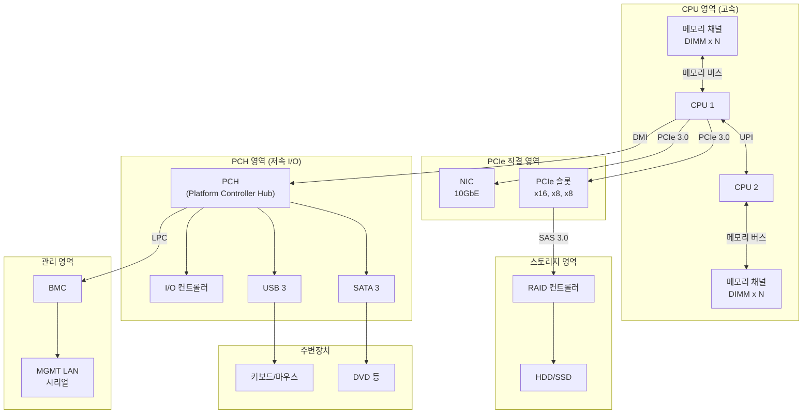

#### 버스 연결 구조 상세 설명

**1. CPU 영역 (고속 처리 중심)**

| 연결 | 설명 | 특징 |
|------|------|------|
| **CPU ↔ 메모리** | 메모리 컨트롤러가 CPU에 내장 | 물리적으로 직접 연결, 가장 빠른 접근 |
| **CPU ↔ CPU (UPI)** | 듀얼 소켓 서버에서 CPU 간 통신 | Ultra Path Interconnect, NUMA 구조 지원 |
| **CPU ↔ PCH (DMI)** | CPU와 칩셋 연결 | Direct Media Interface, 병목 가능성 |
| **CPU ↔ PCIe 슬롯** | 고속 확장 카드 직결 | Xeon은 CPU가 PCIe를 직접 제어 |

**2. PCH 영역 (저속 I/O 관리)**

PCH(Platform Controller Hub)는 CPU가 직접 처리하기엔 느린 장치들을 관리합니다.

| 관리 대상 | 인터페이스 | 용도 |
|-----------|------------|------|
| SATA 3 | SATA 6Gbps | DVD, SATA SSD/HDD |
| USB 3 | USB 3.0/3.1 | 키보드, 마우스 등 |
| 칩셋 I/O 컨트롤러 | 다양 | 레거시 장치 |
| NIC (온보드) | 10GbE | 네트워크 연결 |

**3. 스토리지 영역**

| 구성요소 | 연결 방식 | 특징 |
|----------|-----------|------|
| **RAID 컨트롤러** | SAS 3.0 (PCIe 경유) | 다수의 HDD/SSD를 RAID로 묶음 |
| **NVMe SSD** | PCIe 직결 | CPU와 직접 통신, 최고 속도 |
| **SATA 장치** | PCH 경유 | DVD, SATA SSD 등 |

**4. 관리 영역 (BMC)**

| 구성요소 | 연결 | 역할 |
|----------|------|------|
| **BMC** | LPC 버스로 PCH와 연결 | 서버 원격 관리 |
| **MGMT LAN** | BMC 전용 네트워크 포트 | 관리용 네트워크 (데이터와 분리) |
| **시리얼** | BMC 연결 | 콘솔 접근용 |

#### 왜 이런 구조인가?

**속도에 따른 계층 분리:**


- **CPU 직결**: 고속 처리가 필요한 장치 (메모리, GPU, NVMe)
- **PCH 경유**: 상대적으로 느린 장치 (USB, SATA, 온보드 NIC)
- **BMC**: 메인 시스템과 독립적으로 동작하는 관리 영역

> **핵심 포인트**: CPU를 중심으로 생각하면, 메모리는 가장 가깝고, USB 같은 인터페이스는 PCH를 거쳐야 하므로 상대적으로 멀리 있습니다. 이것이 접근 속도 차이의 원인입니다.

---

### 서버 외관

#### 서버실 (Data Center)

서버실은 물리 서버들이 설치되어 운영되는 전용 시설입니다. 대규모 데이터센터의 경우 수천~수만 대의 서버를 수용하며, 다음과 같은 인프라를 갖추고 있습니다:

- **냉각 시스템**: 서버 발열 관리 (CRAC, 핫/콜드 아일 구성)
- **전력 시스템**: 이중화 전원, UPS, 발전기
- **보안 시스템**: 물리 보안, 접근 통제
- **네트워크 인프라**: 고대역폭 백본 연결

#### 랙 (Rack)

랙은 서버, 네트워크 장비, 스토리지를 **수직으로 적재하는 표준 규격 캐비닛**입니다.

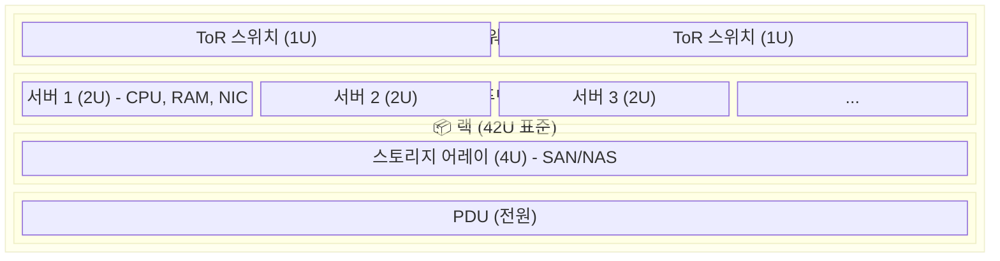

**"U"는 랙 유닛(Rack Unit)의 약자로, 1U = 1.75인치(44.45mm)입니다.**

#### 서버 폼팩터

| 폼팩터 | 높이 | 특징 | 용도 |
|--------|------|------|------|
| **1U** | 44.45mm | 얇고 밀도 높음, 확장성 제한 | 웹서버, 경량 워크로드 |
| **2U** | 88.9mm | 적당한 확장성 | 범용 서버, DB |
| **4U** | 177.8mm | GPU, 스토리지 다량 장착 | AI/ML, 스토리지 서버 |
| **블레이드** | 섀시 공유 | 전원/네트워크 공유, 고밀도 | 대규모 클러스터 |

#### 랙의 세 가지 핵심 구성요소

**1. 네트워크 스위치** - 랙 내 모든 장비를 네트워크에 연결하는 허브 역할

| 종류 | 역할 | 위치 |
|------|------|------|
| ToR 스위치 | 랙 내 장비 연결 | 랙 상단 |
| Aggregation 스위치 | 여러 ToR 스위치 연결 | 랙 간 |
| Core 스위치 | 데이터센터 전체 백본 | 중앙 |

**2. 서버 (컴퓨팅)** - 실제 연산을 수행하는 장비

**3. 스토리지** - 데이터를 저장하는 장비 (DAS, NAS, SAN)

---

### 서버 내부 구성

물리 서버 내부는 다음과 같은 구성요소로 이루어져 있습니다:

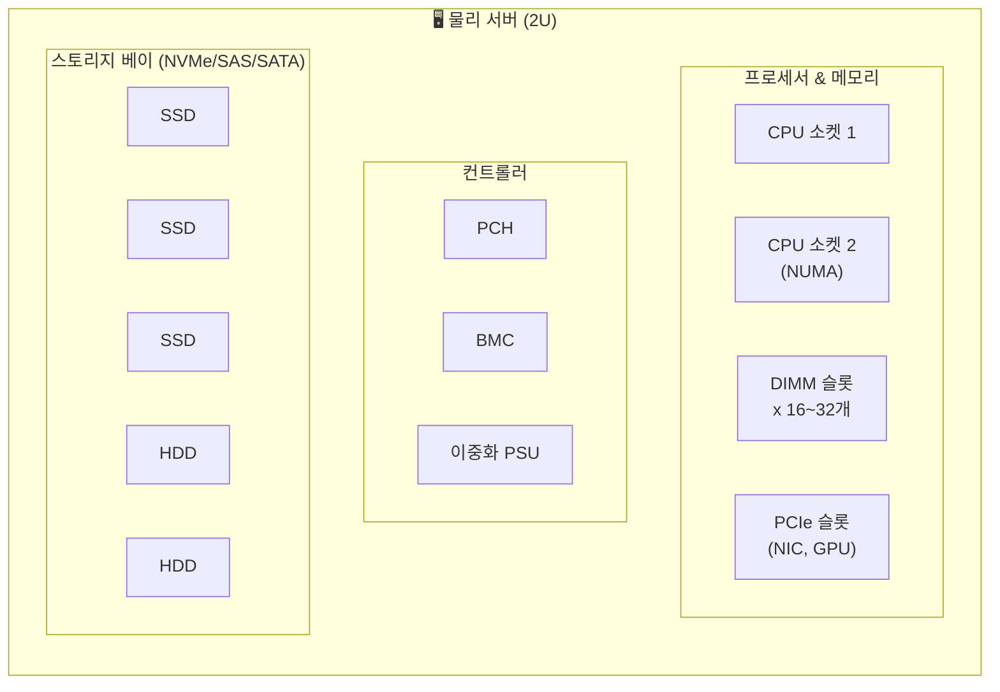

#### 주요 내부 구성요소

| 구성요소 | 역할 | 특징 |
|----------|------|------|
| **CPU 소켓** | 프로세서 장착 | 서버는 1~8개 소켓 지원 (NUMA 구조) |
| **DIMM 슬롯** | 메모리 모듈 장착 | ECC 메모리 필수, 16~32개 슬롯 |
| **PCIe 슬롯** | 확장 카드 연결 | GPU, NIC, HBA 등 장착 |
| **PCH** | 저속 I/O 허브 | USB, SATA, 오디오 관리 |
| **BMC** | 원격 관리 컨트롤러 | 전원 제어, 콘솔 접속, 모니터링 |
| **PSU** | 전원 공급 장치 | 이중화로 무중단 운영 |
| **스토리지 베이** | 디스크 장착 | 핫스왑 지원, 다수 드라이브 수용 |

#### BMC (Baseboard Management Controller)

BMC는 **서버 전용** 구성요소로, 서버를 원격으로 관리하는 독립적인 마이크로컨트롤러입니다.

- **서버 전원이 꺼져 있어도 동작** (대기 전원으로 작동)
- 독자적인 CPU, 메모리, 네트워크 포트 보유
- 메인 OS와 완전히 독립적

**BMC의 주요 기능:**
- 원격 전원 켜기/끄기/재부팅
- 원격 콘솔 접속 (KVM over IP)
- 하드웨어 모니터링 (온도, 팬 속도, 전압)
- BIOS/펌웨어 업데이트
- 장애 로그 수집

**벤더별 구현:**
- Dell: iDRAC
- HP: iLO
- Lenovo: XCC
- 표준 규격: IPMI

---

## CPU

CPU(Central Processing Unit)는 컴퓨터의 "두뇌"로, 실제 연산을 수행하는 핵심 장치입니다.

### CPU 전체 아키텍처

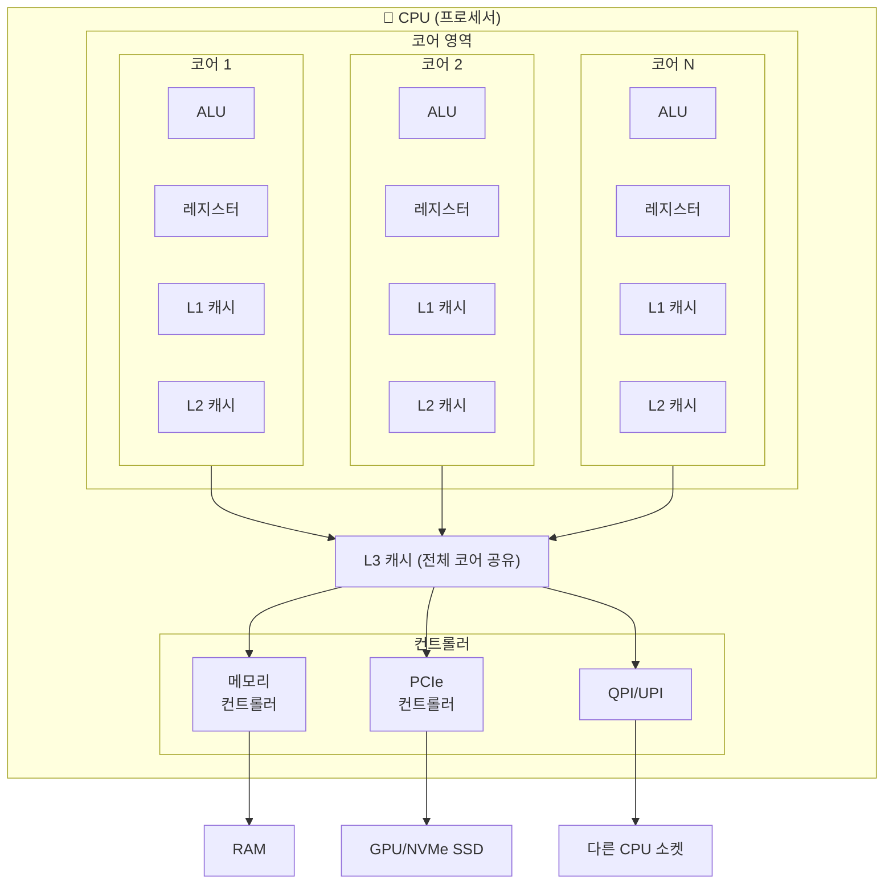

### CPU 내부 구성요소

| 구성요소 | 역할 | 특징 |
|----------|------|------|
| **코어 (Core)** | 명령어 실행 | 독립적 처리 유닛, 멀티코어 구조 |
| **ALU** | 산술/논리 연산 | 코어 내부에서 실제 계산 수행 |
| **레지스터** | 즉시 사용할 데이터 저장 | 가장 빠름, 수십~수백 개 |
| **L1 캐시** | 코어 전용 캐시 | 32~64KB, ~4 사이클 |
| **L2 캐시** | 코어별 또는 공유 캐시 | 256KB~1MB, ~12 사이클 |
| **L3 캐시** | 전체 코어 공유 캐시 | 수~수십 MB, ~40 사이클 |
| **메모리 컨트롤러** | RAM 접근 관리 | CPU에 내장 |
| **PCIe 컨트롤러** | 고속 장치 직접 연결 | GPU, NVMe 등 직결 |
| **QPI/UPI** | 멀티소켓 CPU 간 연결 | 서버용 NUMA 구조 |

### 레지스터 vs L1 캐시

둘 다 CPU 코어 안에 있는 빠른 저장 공간이지만, 역할이 다릅니다.

**레지스터**: CPU가 **지금 당장 연산하는 데이터**를 담는 곳입니다. ALU가 직접 접근해서 계산을 수행합니다.

**L1 캐시**: **곧 쓸 것 같은 데이터**를 미리 가져다 놓는 곳입니다. RAM에서 데이터를 가져올 때 너무 느리니까 임시로 보관합니다.

#### 비유로 이해하기

| 구성요소 | 비유 | 설명 |
|----------|------|------|
| 레지스터 | 손에 들고 있는 재료 | 지금 바로 썰고, 볶는 중 |
| L1 캐시 | 도마 위 재료 | 손 뻗으면 바로 잡을 수 있음 |
| L2/L3 캐시 | 조리대 위 재료 | 몇 걸음 가면 가져올 수 있음 |
| RAM | 냉장고 | 가서 문 열고 찾아야 함 |
| 저장장치 | 마트 | 나가서 사와야 함 |

#### 구체적인 차이점

| | 레지스터 | L1 캐시 |
|---|----------|---------|
| **위치** | ALU 바로 옆 | 코어 내부 (ALU보다는 멂) |
| **용량** | 수십~수백 개 (각 64비트) | 32~64 KB |
| **속도** | 1 사이클 | 3~4 사이클 |
| **접근 방식** | 이름으로 직접 지정 (`RAX`, `R1` 등) | 주소로 자동 관리 |
| **프로그래머 제어** | 어셈블리에서 직접 지정 가능 | 직접 제어 불가 (CPU가 자동 관리) |
| **역할** | 연산 수행 | 데이터 임시 저장 |

#### 데이터 흐름 예시

`x = a + b`를 계산한다면:

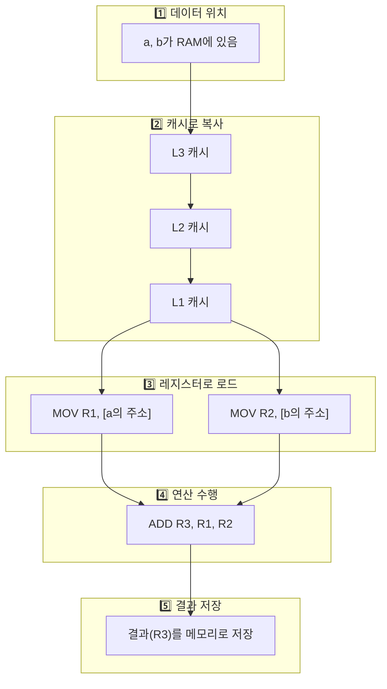

### 캐시 관리: 누가 "곧 쓸 데이터"를 예측하나?

**CPU 하드웨어가 자동으로 관리합니다.** OS나 프로그램이 직접 관여하지 않습니다.

CPU 안에 있는 **캐시 컨트롤러**라는 전용 회로가 실시간으로 "뭘 캐시에 넣을지, 뭘 뺄지"를 결정합니다.

#### 예측의 핵심 원리: 지역성 (Locality)

**시간적 지역성 (Temporal Locality)**
- 최근에 쓴 데이터는 곧 다시 쓸 가능성이 높다
- 예: 반복문의 카운터 변수 `i`는 계속 접근됨

**공간적 지역성 (Spatial Locality)**
- 어떤 주소를 접근하면 근처 주소도 곧 접근할 가능성이 높다
- 예: 배열 순회 시 `arr[0]`, `arr[1]`, `arr[2]`... 연속 접근

#### 캐시 동작 방식

**데이터가 들어오는 시점:**

CPU가 데이터를 요청했는데 캐시에 없으면(cache miss), RAM에서 가져오면서 **자동으로 캐시에 복사**합니다. 이때 **캐시 라인**(보통 64바이트) 단위로 통째로 가져옵니다.

```
arr[0]을 요청하면:
┌─────────────────────────────────────┐
│ arr[0] arr[1] arr[2] ... arr[15]   │  ← 64바이트 통째로 캐시에 로드
└─────────────────────────────────────┘
```

**데이터가 빠지는 시점 (교체 정책):**

| 정책 | 기준 | 특징 |
|------|------|------|
| **LRU** | 가장 오래 안 쓴 것 제거 | 가장 흔함, 시간적 지역성 활용 |
| **FIFO** | 가장 먼저 들어온 것 제거 | 구현 간단 |
| **Pseudo-LRU** | LRU 근사치 | 현대 CPU에서 많이 사용 |

#### 프리페칭 (Prefetching)

아직 요청하지 않은 데이터를 **미리 가져오는** 기법입니다.

```
접근 패턴 감지:  100 → 104 → 108 → 112  (4바이트씩 증가)
              ↓
프리페처:      "116, 120, 124도 미리 로드해두자"
```

### 데이터 접근 속도 비교

```
빠름 ◄──────────────────────────────────────────────────────► 느림

레지스터 → L1 → L2 → L3 → RAM → NVMe → SATA SSD → HDD
  ~1ns    ~1ns  ~3ns ~10ns ~100ns ~10μs   ~50μs    ~5ms
```

| 구성 요소 | 용량 | 지연 시간 (대략) |
|-----------|------|------------------|
| 레지스터 | 수백 바이트 | ~1 사이클 |
| L1 캐시 | 32~64 KB | ~4 사이클 |
| L2 캐시 | 256 KB~1 MB | ~12 사이클 |
| L3 캐시 | 수 MB~수십 MB | ~40 사이클 |
| RAM | 수 GB~수백 GB | ~200+ 사이클 |

---

## 메모리

메모리는 CPU가 처리할 데이터와 프로그램을 임시로 저장하는 공간입니다.

### 메모리 계층 구조

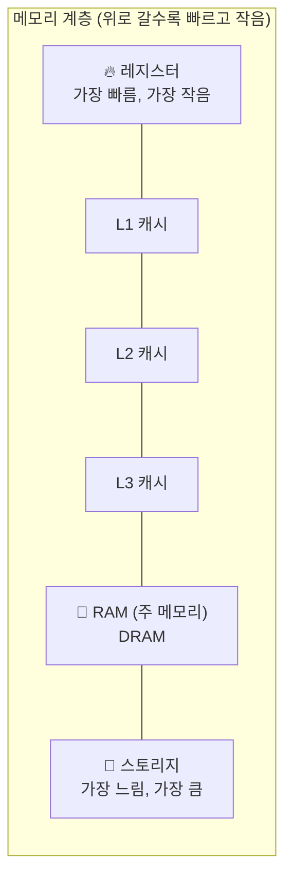

### 메모리 관련 구성요소

| 구성요소 | 역할 | 특징 |
|----------|------|------|
| **DIMM** | RAM 모듈 | DDR4/DDR5, 슬롯에 장착 |
| **채널 (Channel)** | 메모리 대역폭 경로 | 듀얼/쿼드 채널로 대역폭 증가 |
| **ECC 메모리** | 오류 정정 메모리 | 서버 필수, 데이터 무결성 보장 |
| **NVDIMM** | 비휘발성 메모리 모듈 | 전원 꺼져도 데이터 유지 |

### RAM 특성

- **휘발성**: 전원이 꺼지면 데이터 소실
- **랜덤 액세스**: 어느 위치든 동일한 시간에 접근 가능
- **바이트 단위 접근**: 원하는 위치만 읽기/쓰기 가능

### 메모리와 CPU의 관계

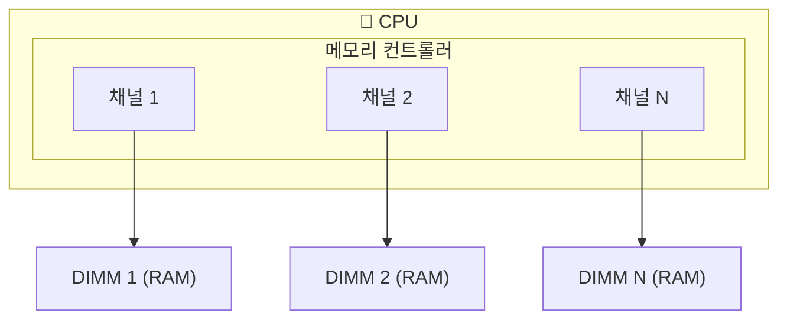

현대 CPU는 **메모리 컨트롤러를 내장**하여 RAM 접근 속도를 높였습니다. 예전에는 메인보드의 노스브릿지에 있었지만, 지금은 CPU 안에 통합되어 있습니다.

---

## I/O 장치

I/O(Input/Output) 장치는 CPU 및 메모리와 외부 세계 간의 데이터 교환을 담당합니다.

### I/O 장치 연결 구조

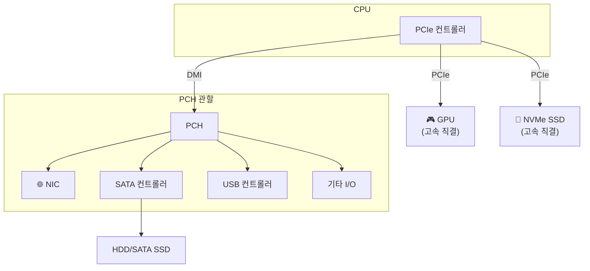

### PCH (Platform Controller Hub)

예전에 **사우스브릿지**라고 부르던 것의 현대 버전입니다. CPU가 직접 처리하기엔 느린 I/O 장치들을 관리합니다.

**PCH가 관리하는 것들:**
- USB 포트
- SATA (하드디스크, SSD)
- 오디오 컨트롤러
- 저속 PCIe 장치
- 내장 NIC

**고속 장치는 CPU 직결, 저속 장치는 PCH 경유:**
```
고속 장치 → CPU 직접 연결 (PCIe 레인)
저속 장치 → PCH 경유 (DMI로 CPU와 연결)
```

### PCIe 슬롯

**Peripheral Component Interconnect Express**의 약자로, 확장 카드를 꽂는 고속 인터페이스입니다.

| 규격 | 레인당 속도 (단방향) | x16 슬롯 총 대역폭 |
|------|---------------------|-------------------|
| PCIe 3.0 | ~1 GB/s | ~16 GB/s |
| PCIe 4.0 | ~2 GB/s | ~32 GB/s |
| PCIe 5.0 | ~4 GB/s | ~64 GB/s |

---

### 하드디스크 드라이브

HDD(Hard Disk Drive)는 자기 디스크를 사용하여 데이터를 저장하는 장치입니다.

#### HDD 내부 구조

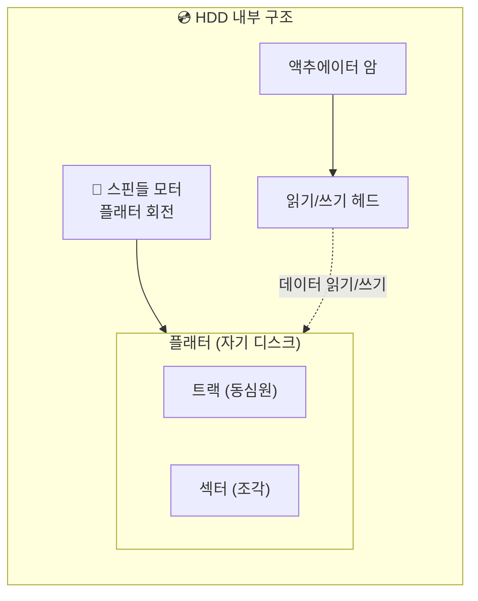

#### HDD 읽기/쓰기 동작 원리

**읽기 과정:**
1. 컨트롤러가 원하는 데이터의 위치(트랙, 섹터) 계산
2. 액추에이터가 헤드를 해당 트랙으로 이동 (**탐색 시간, Seek Time**)
3. 플래터가 회전하여 원하는 섹터가 헤드 아래로 옴 (**회전 지연, Rotational Latency**)
4. 헤드가 자기 신호를 읽어 전기 신호로 변환
5. 데이터 전송 (**전송 시간, Transfer Time**)

**쓰기 과정:**
1. 동일하게 위치 탐색
2. 헤드가 전기 신호를 자기 신호로 변환하여 플래터에 기록

#### HDD 성능 지표

| 지표 | 설명 | 일반적인 값 |
|------|------|-------------|
| **탐색 시간** | 헤드가 트랙으로 이동하는 시간 | 3~15ms |
| **회전 지연** | 섹터가 헤드 아래로 오는 시간 | 2~6ms (RPM에 따라) |
| **RPM** | 분당 회전수 | 5400, 7200, 10000, 15000 |
| **전송 속도** | 데이터 전송 속도 | 100~200 MB/s |

#### HDD vs SSD 비교

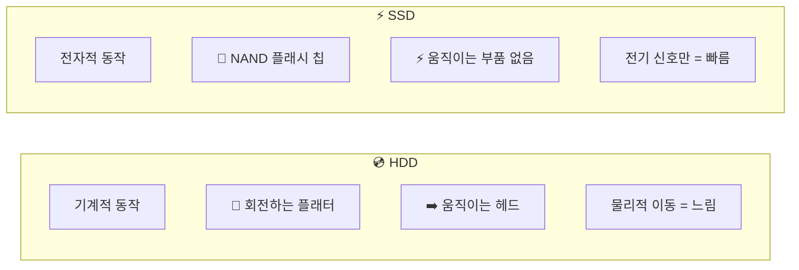

| 특성 | HDD | SSD |
|------|-----|-----|
| **저장 방식** | 자기 디스크 | NAND 플래시 메모리 |
| **동작 방식** | 기계적 (모터, 헤드) | 전자적 (전기 신호) |
| **랜덤 읽기** | ~0.1 MB/s (느림) | ~500 MB/s (빠름) |
| **순차 읽기** | ~150 MB/s | ~500 MB/s (SATA), ~7 GB/s (NVMe) |
| **지연 시간** | ~5-10ms | ~0.1ms (SATA), ~0.02ms (NVMe) |
| **내구성** | 기계적 충격에 약함 | 충격에 강함 |
| **소음** | 있음 (모터, 헤드) | 없음 |
| **가격 (용량당)** | 저렴 | 비쌈 |
| **수명** | 마모 없음 | 쓰기 횟수 제한 (TBW) |

#### SSD 인터페이스 종류

| 인터페이스 | 연결 방식 | 최대 속도 | 특징 |
|------------|-----------|-----------|------|
| **SATA** | SATA 포트 | ~600 MB/s | HDD 호환, 느림 |
| **NVMe (M.2)** | PCIe 직결 | ~7 GB/s+ | 빠름, 현대 표준 |
| **U.2** | PCIe 직결 | ~7 GB/s+ | 서버용, 핫스왑 |

---

### 네트워크 인터페이스

NIC(Network Interface Card)는 컴퓨터를 네트워크에 연결하는 장치입니다.

#### NIC의 역할

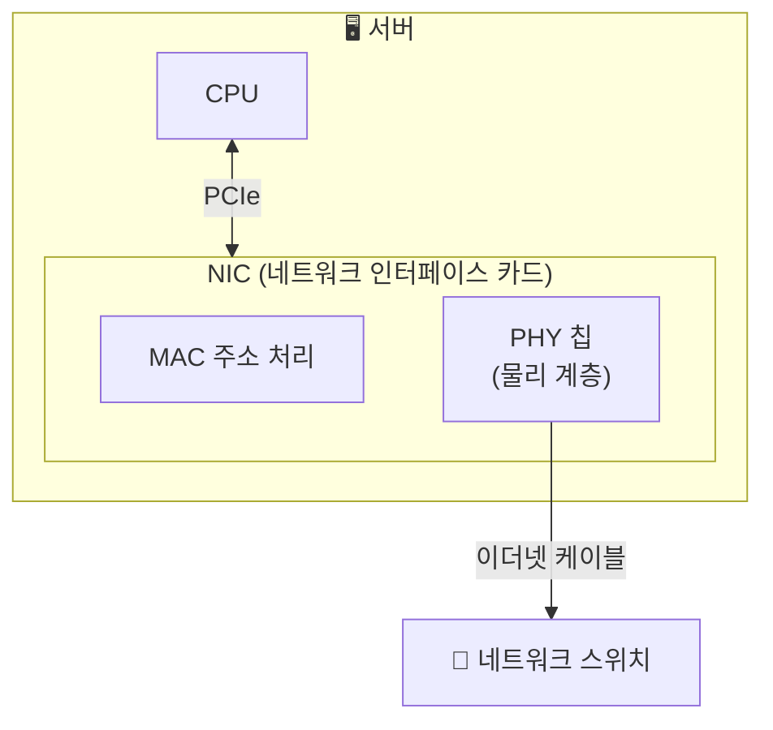

#### NIC의 주요 기능

- **MAC 주소 관리**: 고유한 하드웨어 주소 보유
- **프레임 송수신**: 이더넷 프레임 생성 및 해석
- **물리 계층 변환**: 디지털 신호 ↔ 전기/광 신호
- **버퍼링**: 송수신 데이터 임시 저장
- **인터럽트 생성**: CPU에 데이터 도착 알림

#### 이더넷 (Ethernet)

이더넷은 **LAN(Local Area Network)에서 가장 널리 사용되는 네트워크 표준**입니다.

**이더넷 프레임 구조:**

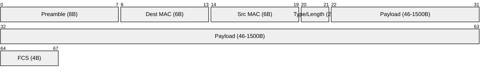

#### 이더넷 속도 표준

| 표준 | 속도 | 케이블 | 용도 |
|------|------|--------|------|
| **Fast Ethernet** | 100 Mbps | Cat5 | 레거시 |
| **Gigabit Ethernet** | 1 Gbps | Cat5e/Cat6 | 일반 PC |
| **10 Gigabit** | 10 Gbps | Cat6a/광섬유 | 서버, 데이터센터 |
| **25 Gigabit** | 25 Gbps | SFP28/광섬유 | 서버 |
| **100 Gigabit** | 100 Gbps | QSFP28/광섬유 | 백본, 스위치 간 |

#### 네트워크 어댑터 종류

| 종류 | 특징 | 용도 |
|------|------|------|
| **온보드 NIC** | 메인보드 내장 | 일반 PC, 기본 서버 |
| **PCIe NIC** | 확장 카드 | 고속 네트워크, 다중 포트 |
| **SmartNIC / DPU** | 자체 CPU 탑재, 오프로드 | 클라우드, 가상화 |
| **HBA (FC)** | 파이버 채널 | SAN 스토리지 연결 |
| **InfiniBand HCA** | RDMA 지원, 초저지연 | HPC, AI 클러스터 |

#### NIC와 네트워크 연결 구조

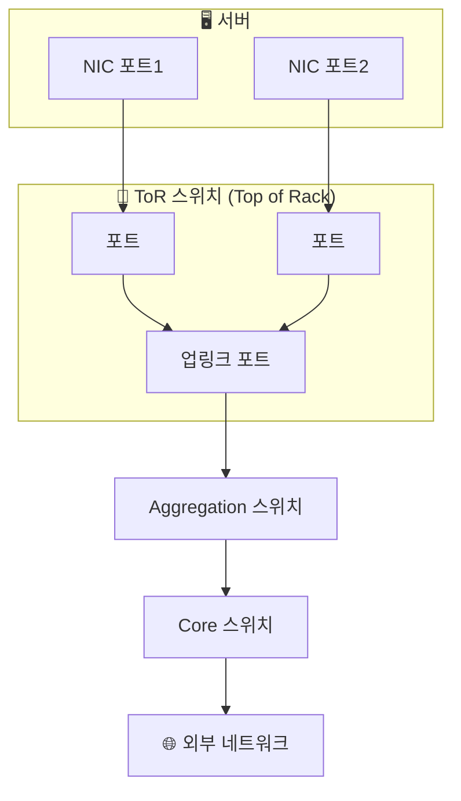

> **이중화 (본딩/티밍)**: 서버는 보통 2개 이상의 NIC 포트를 사용하여 네트워크 장애에 대비합니다.

---

## 부록: 전체 구성요소 요약

### 계층별 위치 관계


### 서버 vs 일반 PC 차이

| 구성요소 | 일반 PC | 서버 |
|----------|---------|------|
| CPU 소켓 | 1개 | 1~8개 (NUMA) |
| BMC | 없음 | 있음 (필수) |
| ECC 메모리 | 선택적 | 필수 |
| NIC | 1GbE 내장 | 10G+ 별도 장착 |
| 전원 | 단일 PSU | 이중화 PSU |
| 스토리지 | SATA/NVMe | SAS/NVMe + RAID |
| 핫스왑 | 없음 | 지원 |

### 데이터 흐름 속도 비교

| 구성 요소 | 용량 | 지연 시간 |
|-----------|------|-----------|
| 레지스터 | 수백 바이트 | ~1ns |
| L1 캐시 | 32~64 KB | ~1ns |
| L2 캐시 | 256KB~1MB | ~3ns |
| L3 캐시 | 수~수십 MB | ~10ns |
| RAM | 수 GB~수백 GB | ~100ns |
| NVMe SSD | 수백 GB~수 TB | ~10μs |
| SATA SSD | 수백 GB~수 TB | ~50μs |
| HDD | 수 TB | ~5ms |
| 네트워크 | - | ~1ms+ |
