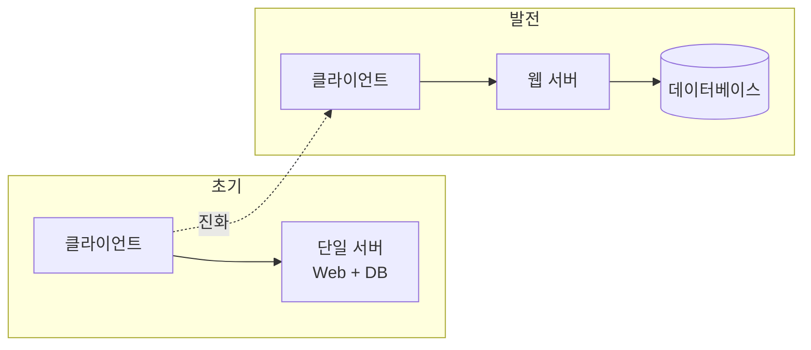
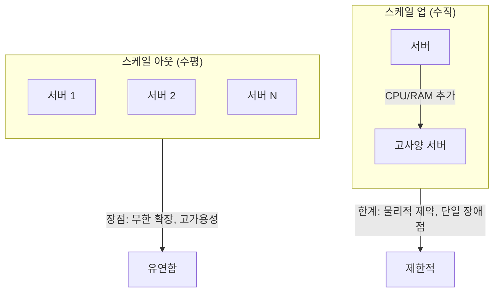
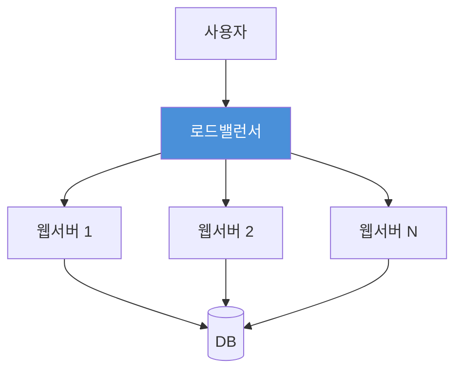
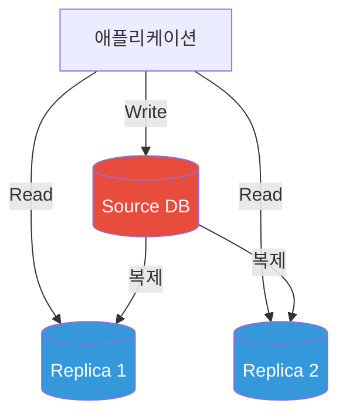
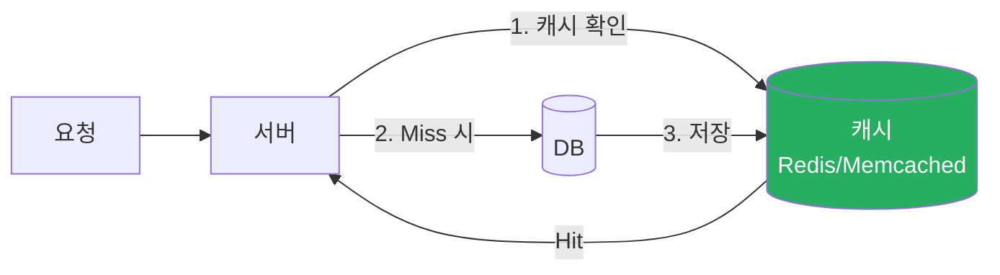
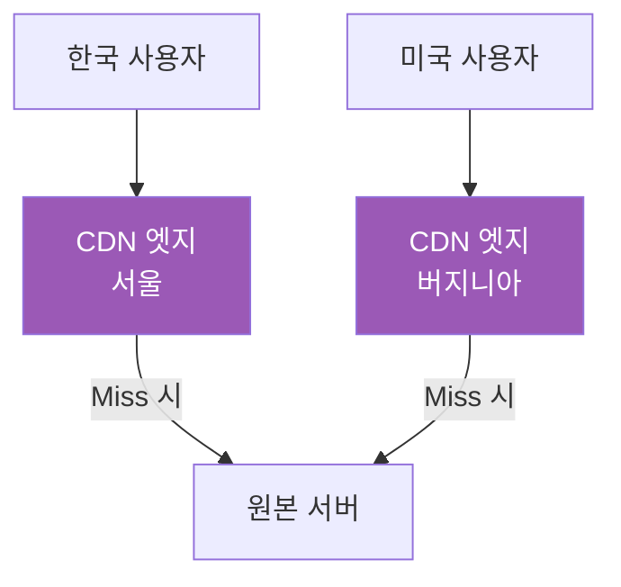
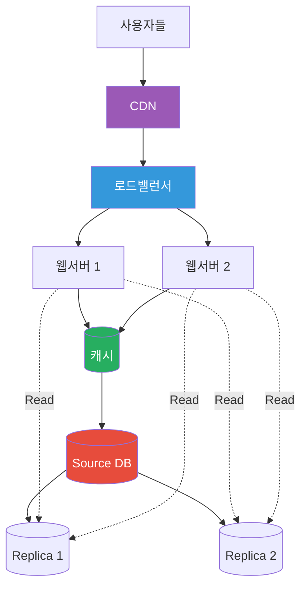

# 사용자 수에 따른 규모 확장성

## 1. 기본 아키텍처 진화

### 단일 서버에서 분리 구조로

**분리 이유**: 웹 서버는 저렴하고 수평 확장이 쉬운 반면, DB는 비용이 높아 수직 확장에 집중

---

## 2. 확장 방식 비교

| 구분 | 스케일 업 | 스케일 아웃 |
|------|----------|------------|
| 방식 | 서버 성능 강화 | 서버 수량 증가 |
| 장점 | 구현 단순 | 무제한 확장, HA 가능 |
| 단점 | 물리적 한계, 장애 대응 불가 | 복잡도 증가 |

---

## 3. 로드밸런서 구조

**핵심 역할**
- 트래픽 분산으로 서버 부하 균등화
- 장애 서버 자동 감지 및 우회
- L4/L7 등 다양한 레이어에서 동작

---

## 4. DB 다중화 (Source-Replica)

**이점**
- 읽기 트래픽 분산 (대부분 Read 연산)
- Source 장애 시 Replica 승격으로 빠른 복구
- 지리적 분산으로 재해 대비

---

## 5. 캐시 계층

**주의사항**
- 데이터 변경 시 캐시 무효화 필수
- 만료 정책 설정 (LRU, LFU, FIFO)
- 원본 갱신과 캐시 갱신의 트랜잭션 일관성

---

## 6. CDN (정적 콘텐츠 전송)

**특징**
- 사용자와 가장 가까운 서버에서 정적 파일 제공
- 이미지, JS, CSS, 비디오 등 캐싱
- 콘텐츠 갱신: API 무효화 또는 버전 관리

---

## 7. 전체 아키텍처 조감도

---

## 핵심 정리

| 구성요소 | 목적 | 핵심 이점 |
|---------|------|----------|
| 로드밸런서 | 트래픽 분산 | 고가용성, 수평 확장 |
| DB 다중화 | 읽기 성능 + 안정성 | 장애 복구, 부하 분산 |
| 캐시 | 응답 속도 향상 | DB 부하 감소 |
| CDN | 정적 콘텐츠 배포 | 지연시간 최소화 |