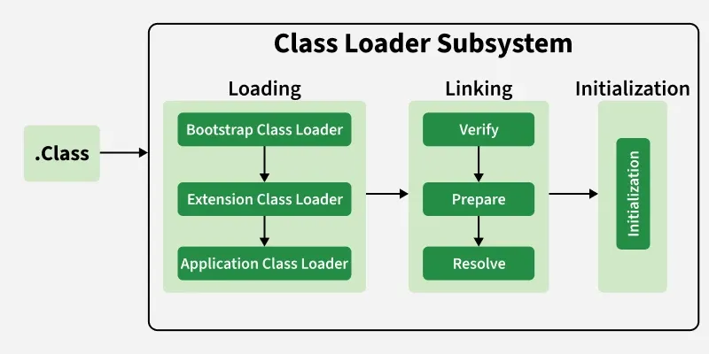

# JVM 내부 구조

크게 5개의 영역으로 나뉜다.
1. Class Loader
2. Runtime Data Area
3. Execution Engine
4. Native Method Interface(JNI)
5. Native Method Library


# Class Loader
JVM이 .class 파일(바이트코드)을 메모리에 올려서 실행 가능한 상태로 만드는 컴포넌트
-> "클래스"를 load, link, initialize하는 역할



## 동작 과정
크게 Loading -> Linking -> Initializing

| 단계              | 세부작업                                                                                                                                   | 언제 일어나나?                        |
|-----------------|----------------------------------------------------------------------------------------------------------------------------------------|---------------------------------|
| 1. Loading      | .class 파일을 파일시스템/JAR/네트워크 등에서 찾아서 바이트코드를 읽어옴 -> Method Area(Metaspace)에 올림                                                             | 클래스 처음 사용될 때 (new, static 접근 등) |
| 2. Linking      | 1. Verification : 바이트코드가 유효한지 검사 (보안)<br/>2. Preparation : static 변수 메모리 할당 + 기본값 설정<br/>3. Resolution : 상수 풀의 심볼릭 레퍼런스를 실제 메모리 주소로 바꿈 | Loading 직후 자동으로                 |
| 3. Initializing | static 초기화 블록 + static 변수 초기화 코드 실행                                                                                                    | Linking 끝난 후, 클래스가 실제로 사용되기 직전  |

## Class Loader 종류

| 계층레벨   | 실제 클래스명                                             | 누가 만들었을까?       | 어떤 클래스들을 로드할 책임이 있나?                             | 부모                    | getClassLoader() 결과                                  |
|--------|-----------------------------------------------------|-----------------|--------------------------------------------------|-----------------------|------------------------------------------------------|
| 1(최상위) | Bootstrap ClassLoader(primitive)                    | JVM 자체(C++로 구현) | 핵심 코어 클래스들<br/>java.lang., java.util., java.io.* 등 | null                  | null                                                 |
| 2      | Platform ClassLoader                                | JDK 내부(Java 코드) | 플랫폼 클래스들<br/>java.sql, java.xml 등                | Bootstrap ClassLoader | jdk.internal.loader.ClassLoaders$PlatformClassLoader |
| 3      | Application ClassLoader<br/>(또는 System ClassLoader) | JDK 내부(Java 코드) | 우리가 만든 애플리케이션 클래스<br/>`-cp`, `-classpath`, `java -jar`로 지정한 모든 JAR | Platform ClassLoader  | jdk.internal.loader.ClassLoader$AppClassLoader       |

## 확인하는 방법
```java
public class ClassLoaderTest {

  @Test
  void test() {
    // given
    // when
    System.out.println("String.class : " + String.class.getClassLoader()); // null
    System.out.println("javax.crypto.Cipher.class : " + javax.crypto.Cipher.class.getClassLoader()); // null
    System.out.println("java.sql.DriverManager.class : " + java.sql.DriverManager.class.getClassLoader()); // Platform
    System.out.println("ClassLoaderTest.class : " + ClassLoaderTest.class.getClassLoader()); // AppClassLoader
    System.out.println("System ClassLoader: " + ClassLoader.getSystemClassLoader()); // AppClassLoader 본인
    // then
  }
}
```
실행결과
```text
String.class : null
javax.crypto.Cipher.class : null
java.sql.DriverManager.class : jdk.internal.loader.ClassLoaders$PlatformClassLoader@2f54a33d
ClassLoaderTest.class : jdk.internal.loader.ClassLoaders$AppClassLoader@1dbd16a6
System ClassLoader: jdk.internal.loader.ClassLoaders$AppClassLoader@1dbd16a6
```

## Parent Delegation Model (부모 위임 모델)
1. 클래스를 로드해 달라는 요청이 오면
2. 무조건 먼저 부모 클래스 로더에게 위임한다.
3. 부모가 못 찾으면 그때서야 자기 자신이 직접 찾는다.
4. 그래도 못 찾으면 ClassNotFoundException을 발생시킨다.

### 왜 생겼을까?

| 목적       | 설명                                                          | 예시                                                                                  |
|----------|-------------------------------------------------------------|-------------------------------------------------------------------------------------|
| Security | java.lang.String 같은 코어 클래스를 절대 개발자가 재정의할 수 없게 막는다.          | 개발자가 악의적으로 java.lang.String을 만들어도 Bootstrap이 먼저 진짜 String을 로드한다<br/>-> 개발자가 만든건 무시됨 |
| 중복 방지    | 같은 클래스가 JVM 안에 두 번 로드되는 걸 원천 차단 -> 메모리 낭비 + Type Safety 보장  | gson.jar이 두 번 classpath에 있어도 단 한 번만 로드됨                                             |
| 안전성 & 캐싱 | 이미 로드된 클래스는 부모가 캐싱하고 있으므로, 모든 ClassLoader가 동일한 Class 객체를 공유 | String.class == String.class 는 항상 true                                              |

## 실무에서 자주 만나는 ClassLoader 이슈 Top3

| 에러                                    | 원인                                                                              | 해결방법                                                                                                                      |
|---------------------------------------|---------------------------------------------------------------------------------|---------------------------------------------------------------------------------------------------------------------------|
| java.lang.NoClassDefFoundError        | ClassLoader Leak (특히 Tomcat/JBoss/WebLogic 재배포시 이전 WebappClassLoader가 GC안됨)     | 1. 애플리케이션 메모리 누수 분석 (VisualVM, Eclipse MAT, JMC)<br/>2. ZGC 또는 Shenandoah 사용 (클래스 언로딩 속도 자체를 극적으로 개선)                     | 
| java.lang.OutOfMemoryError: Metaspace | 동적 클래스 생성 폭주 (CGLIB, ByteBuddy, Groovy, Javassist, 반복 Spring DevTools reload 등) | 1. `-XX:MaxMetaspaceSize=512m` 등으로 조정<br/>2. 동적 프록시/코드 생성 최소화`                                                            |
| java.lang.ClassNotFoundException      | classpath 누락 또는 Custom ClassLoader가 부모에게 위임하지 않음                               | 1. `java -cp` 확인 + `java -verbose:class`로 로드 경로 확인<br/>2. Custom ClassLoader의 `loadClass()`가 `super.loadClass()` 호출하는지 확인 |


### 참고
- [Geeks for geeks - How JVM works](https://www.geeksforgeeks.org/java/how-jvm-works-jvm-architecture/)
- [Java SE 25](https://docs.oracle.com/javase/specs/jvms/se25/jvms25.pdf)
