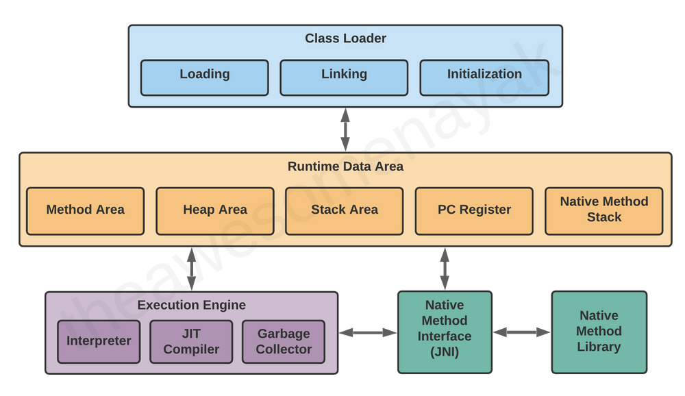

# JVM 내부 구조

크게 5개의 영역으로 나뉜다.
1. Class Loader
2. Runtime Data Area
3. Execution Engine
4. Native Method Interface(JNI)
5. Native Method Library

# Components
- JIT Compiler
- Native Method Interface (JNI)
- Native Method Library

# JIT Compiler

Java 프로그램을 컴파일할 때(javac 같은 명령어를 사용), 소스 코드는 코드의 이진 표현인 JVM bytecode(JVM이 이해할 수 있는 bytecode 형태)로 컴파일된다.
 이 bytecode는 소스 코드보다 더 단순하고 더 압축되어 있지만, 컴퓨터의 CPU가 직접 실행할 수 있는 형태는 아니다.

Java 프로그램을 실행할 수 있도록 하기 위해, JVM은 이 bytecode를 하나씩 해석하며 실행한다.
 하지만 interpreter은 일반적으로 실제 CPU에서 실행되는 native code보다 훨씬 느리기 때문에,
 JVM은 실행 중에 또 다른 compiler를 실행하고, 이 compiler는 이 bytecode를 CPU가 바로 실행할 수 있는 machine code로 컴파일한다.

이렇게 실행 시점에 동작하는 컴파일러를 JIT(just-in-time) compiler라고 하며, 단순히 소스 코드를 JVM bytecode로 바꾸는 javac 컴파일러보다 훨씬 더 정교하다.
 JIT 컴파일러는 성능이 뛰어난 machine code를 생성하기 위해 복잡한 최적화를 수행한다.

*고품질의 machine code : CPU가 더 적은 비용으로, 더 빠르고 예측 가능하게 실행할 수 있도록 최적화된 기계어

# Garbage Collector

Garbage Collector에 대한 내용은 [해당 페이지](/wiki/java/gc)를 참고해주세요.

# Native Method Interface(JNI)
JNI는 Native Method Interface로,
 JVM 안에서 실행되는 Java 코드가 C, C++, 어셈블리와 같은 다른 프로그래밍 언어로 작성된 애플리케이션 및 라이브러리와 함께 동작할 수 있도록 해준다.
 JNI의 가장 큰 장점은, JVM의 내부 구현 방식에 어떠한 제약을 주지 않는다는 점이다. 따라서 JVM을 만드는 벤더들은 VM의 다른 부분을 변경하지 않고도 JNI를 지원할 수 있다.
 또한 개발자는 native 애플리케이션이나 라이브러리를 한 번만 작성해 두면, JNI를 지원하는 모든 JVM에서 사용할 수 있다.

## 개요
애플리케이션을 전부 Java로 작성할 수는 있지만, Java만으로는 애플리케이션의 요구 사항을 만족시키기 어려운 경우도 있다. 
 이러한 경우에 개발자들은 JNI를 사용하여 Java native method를 작성한다.

Java native method가 필요한 경우
- Java 표준 라이브러리에는 없지만, 특정 OS나 하드웨어에서만 가능한 기능이 꼭 필요한 경우
- 이미 다른 언어로 작성된 라이브러리가 있으며, 이를 JNI를 통해 Java 코드에서 사용하고 싶은 경우
- 성능이 매우 중요한 일부 코드를 어셈블리 같은 저수준 언어로 구현하고 싶은 경우

JNI를 통해 프로그래밍함으로써, native method를 사용하여 다음과 같은 작업을 수행할 수 있다.
- Java 객체(배열과 문자열을 포함) 생성, 검사 및 수정
- Java 메서드 호출
- 예외를 잡거나 던지기
- 클래스 로드 및 클래스 정보 얻기
- 런타임 시점에 타입 검사 수행

또한 JNI를 Invocation API와 함께 사용하면, native 애플리케이션안에 JVM을 직접 내장할 수도 있다.
 이를 통해 개발자는 VM 소스 코드에 직접 의존하지 않고도 기존 애플리케이션을 쉽게 Java를 지원하는 애플리케이션으로 만들 수 있다.

JNI로 할 수 있는 많은 작업들은 최근에 도입된 Foreign Function & Memory API(FFM)로도 구현할 수 있으며, 가능하다면 JNI보다 FFM API를 사용하는 것이 권장된다.

# Native Method Library
native method는 Java가 아닌 언어로 구현되어, Java 코드에서 호출해 사용할 수 있는 메서드다.
 이를 통해 Java만으로는 직접 접근할 수 없는 운영체제 수준의 기능이나 특정 플랫폼의 API를 사용할 수 있다.

다만, native method는 시스템 종속적인 코드를 포함하기 때문에 애플리케이션의 이식성을 떨어뜨리는 단점이 있다.
 이러한 native method는 새로 작성한 native code일 수도 있고, 이미 존재하는 native library를 호출하는 native code일 수도 있다.

native method를 사용하기로 결정하면, 해당 메서드는 자신이 실행되는 JVM과 원활하게 상호 작용해야 한다.
 이를 위해 JNI가 제공되며, JNI는 특정 플랫폼에 종속되지 않는 방식으로 native code와 JVM간의 상호 작용을 지원한다.

JNI는 native method가 JVM과 다양한 방식으로 상호 작용할 수 있도록 하는 인터페이스 모음이다.
 예를 들어, 새로운 객체를 생성하거나 메서드를 호출하고, 필드 값을 읽고 쓰며, 예외를 처리하거나 문자열과 배열을 다루는 기능들을 제공한다.

### 참고
- [Geeks for geeks - How JVM Works](https://www.geeksforgeeks.org/java/how-jvm-works-jvm-architecture/)
- [graal-java-jit-compiler](https://www.baeldung.com/graal-java-jit-compiler)
- [IBM - Native methods and the Java Native Interface](https://www.ibm.com/docs/en/i/7.6.0?topic=languages-native-methods-java-native-interface)

